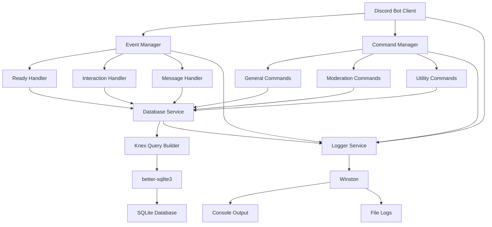
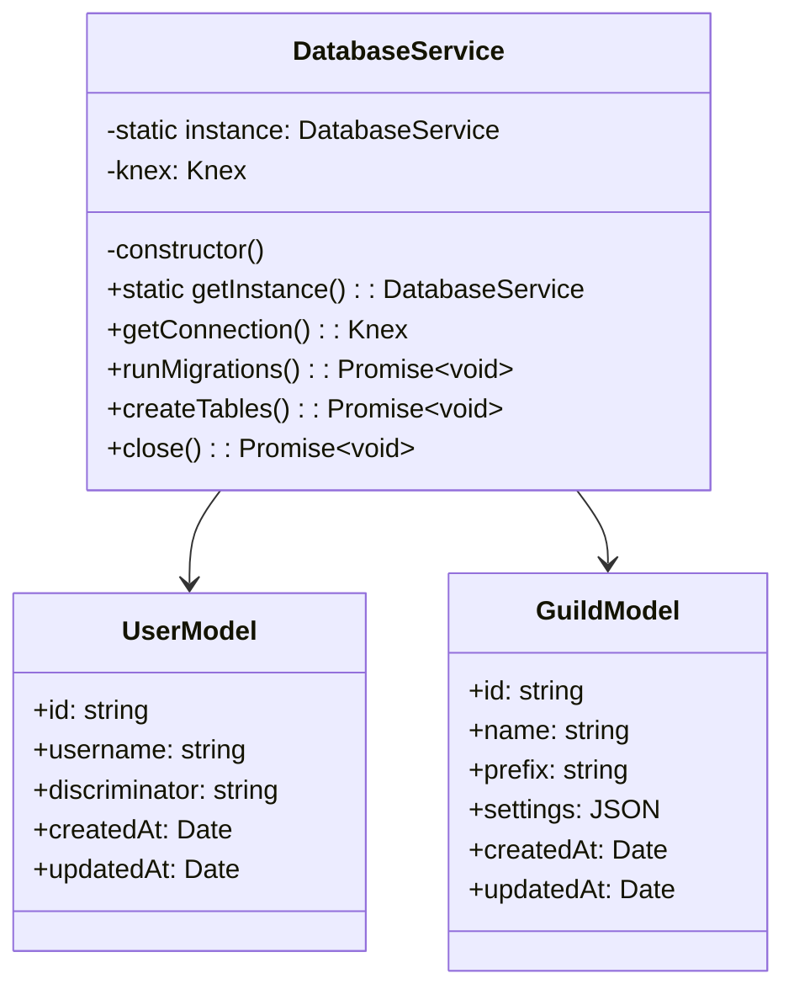
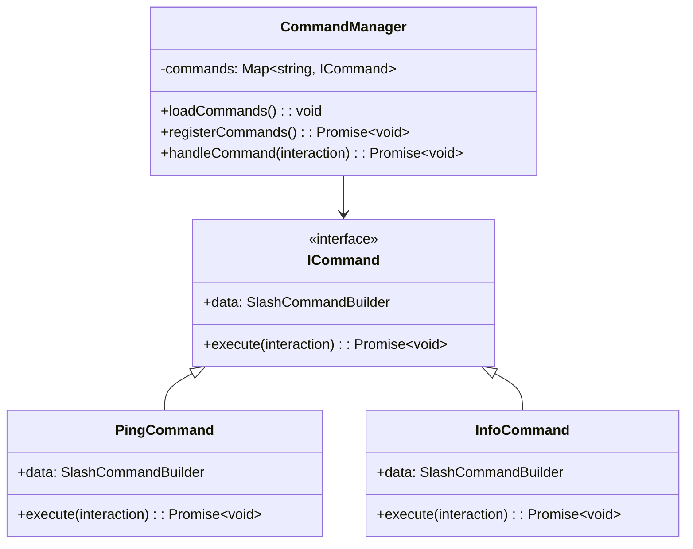
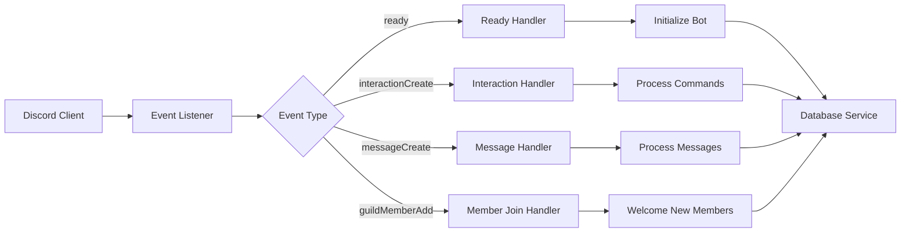
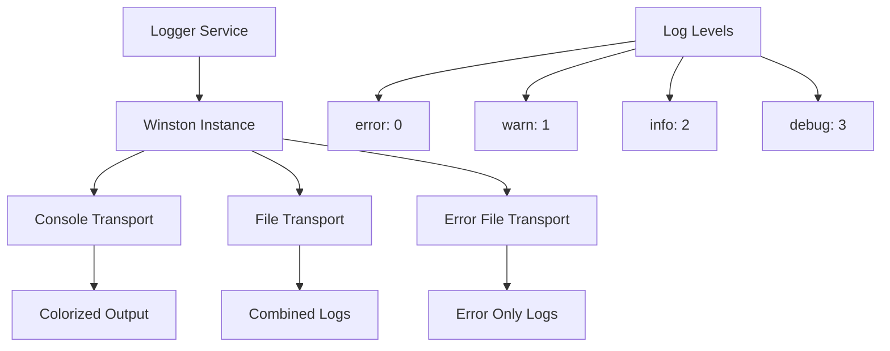
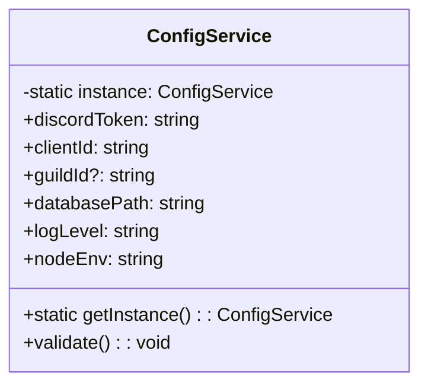
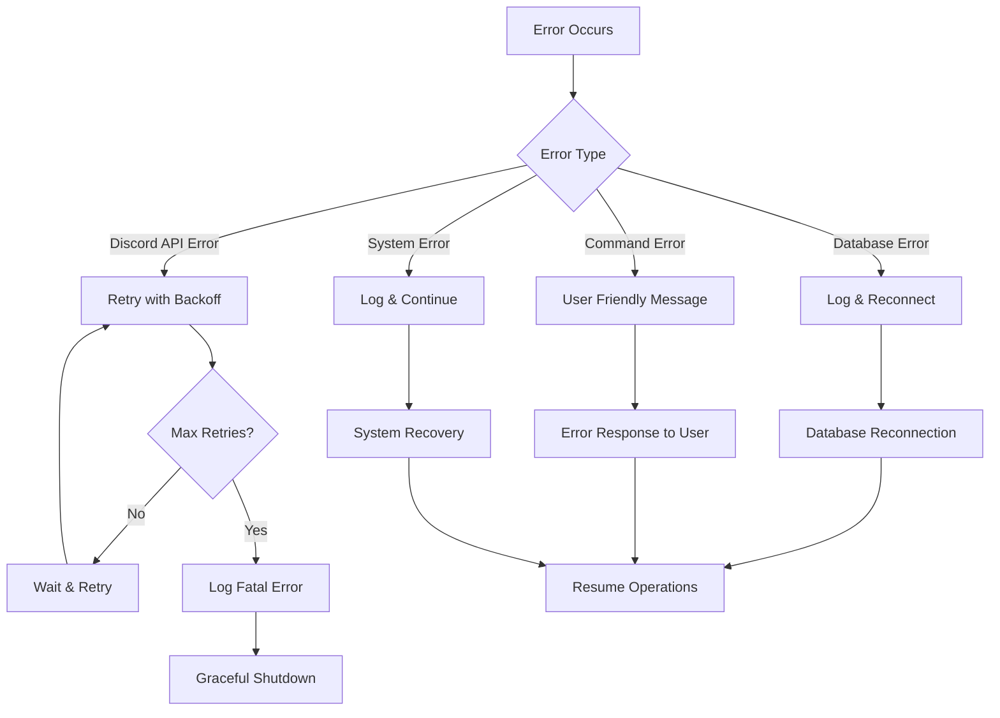

# Discord Bot Starter Project Design

## Overview

A comprehensive TypeScript Discord bot starter project that provides a solid foundation for building Discord bots with modern development practices. The project includes database integration, logging, command handling, and event management systems.

### Key Features
- **Discord.js v14** for Discord API integration
- **TypeScript** for type safety and better development experience
- **KnexJS + better-sqlite3** for database operations with migration support
- **Singleton Database Service** for centralized database management
- **Winston Logger** for comprehensive logging
- **Command Handler System** with slash commands support
- **Event Management System** for Discord events
- **Environment Configuration** management
- **Error Handling** and graceful shutdown

## Technology Stack & Dependencies

### Core Dependencies
| Package | Version | Purpose |
|---------|---------|---------|
| discord.js | ^14.x | Discord API wrapper |
| knex | ^3.x | SQL query builder |
| better-sqlite3 | ^9.x | SQLite3 database driver |
| winston | ^3.x | Logging framework |
| dotenv | ^16.x | Environment variables |

### Development Dependencies
| Package | Version | Purpose |
|---------|---------|---------|
| typescript | ^5.x | TypeScript compiler |
| @types/node | ^20.x | Node.js type definitions |
| ts-node | ^10.x | TypeScript execution |
| nodemon | ^3.x | Development auto-restart |
| eslint | ^8.x | Code linting |
| prettier | ^3.x | Code formatting |

## Architecture

### Project Structure
```
src/
├── commands/           # Slash commands
│   ├── general/       # General purpose commands
│   ├── moderation/    # Moderation commands
│   └── index.ts       # Command registry
├── events/            # Discord event handlers
│   ├── ready.ts       # Bot ready event
│   ├── interactionCreate.ts  # Command interactions
│   └── index.ts       # Event registry
├── services/          # Business logic services
│   ├── database/      # Database service layer
│   │   ├── DatabaseService.ts  # Singleton DB service
│   │   ├── models/    # Database models
│   │   └── migrations/# Database migrations
│   ├── logger/        # Logging service
│   └── config/        # Configuration management
├── types/             # TypeScript type definitions
├── utils/             # Utility functions
└── index.ts           # Application entry point
```

### System Architecture Diagram



## Database Architecture

### DatabaseService Singleton Pattern



### Database Schema Design

#### Users Table
| Column | Type | Description |
|--------|------|-------------|
| id | VARCHAR(20) PRIMARY | Discord user ID |
| username | VARCHAR(32) | Discord username |
| discriminator | VARCHAR(4) | Discord discriminator |
| created_at | DATETIME | Record creation timestamp |
| updated_at | DATETIME | Record update timestamp |

#### Guilds Table
| Column | Type | Description |
|--------|------|-------------|
| id | VARCHAR(20) PRIMARY | Discord guild ID |
| name | VARCHAR(100) | Guild name |
| prefix | VARCHAR(5) | Custom command prefix |
| settings | TEXT | JSON configuration |
| created_at | DATETIME | Record creation timestamp |
| updated_at | DATETIME | Record update timestamp |

#### User_Guilds Junction Table
| Column | Type | Description |
|--------|------|-------------|
| user_id | VARCHAR(20) | Foreign key to users.id |
| guild_id | VARCHAR(20) | Foreign key to guilds.id |
| roles | TEXT | JSON array of roles |
| joined_at | DATETIME | User join timestamp |

## Command System Architecture

### Command Structure Pattern



### Command Categories

#### General Commands
- **ping** - Bot latency and API response time
- **info** - Bot information and statistics  
- **help** - Command help and documentation
- **userinfo** - Display user profile information
- **serverinfo** - Display server information

#### Moderation Commands
- **kick** - Kick user from server
- **ban** - Ban user from server
- **timeout** - Timeout user temporarily
- **clear** - Bulk delete messages
- **warn** - Issue warning to user

## Event Management System

### Event Handler Pattern



### Core Events
- **ready** - Bot initialization and startup
- **interactionCreate** - Slash command interactions
- **messageCreate** - Message processing and prefix commands
- **guildCreate** - Bot joins new server
- **guildMemberAdd** - New member joins server
- **error** - Error handling and logging

## Logging Architecture

### Winston Logger Configuration



### Log Categories
- **System Logs** - Bot startup, shutdown, errors
- **Command Logs** - Command execution and results  
- **Database Logs** - Query execution and errors
- **Event Logs** - Discord event processing
- **Security Logs** - Permission checks and violations

## Configuration Management

### Environment Variables

| Variable | Description | Default | Required |
|----------|-------------|---------|----------|
| DISCORD_TOKEN | Bot token from Discord Developer Portal | - | ✅ |
| CLIENT_ID | Discord application client ID | - | ✅ |
| GUILD_ID | Test guild ID for development | - | ❌ |
| DATABASE_PATH | SQLite database file path | ./data/bot.db | ❌ |
| LOG_LEVEL | Logging level (error/warn/info/debug) | info | ❌ |
| NODE_ENV | Environment (development/production) | development | ❌ |

### Configuration Service Pattern



## Error Handling & Recovery

### Error Handling Strategy



### Error Types & Handling
- **Discord API Errors** - Rate limiting, permissions, network issues
- **Database Errors** - Connection failures, constraint violations
- **Command Errors** - Invalid parameters, missing permissions
- **System Errors** - Memory issues, file system errors

## Development Workflow

### TypeScript Configuration
- **Strict Type Checking** enabled for better code quality
- **ES2022 Target** for modern JavaScript features
- **Path Mapping** for clean imports
- **Declaration Files** for type definitions

### Development Scripts
- `npm run dev` - Start development server with hot reload
- `npm run build` - Compile TypeScript to JavaScript
- `npm run start` - Start production server
- `npm run lint` - Run ESLint code analysis
- `npm run format` - Format code with Prettier
- `npm run migrate` - Run database migrations

## Testing Strategy

### Testing Framework Setup
- **Jest** for unit testing
- **Supertest** for integration testing
- **Test Database** separate from development
- **Mock Discord Client** for testing commands

### Test Categories
- **Unit Tests** - Individual functions and classes
- **Integration Tests** - Database operations and API calls
- **Command Tests** - Slash command functionality
- **Event Tests** - Event handler responses